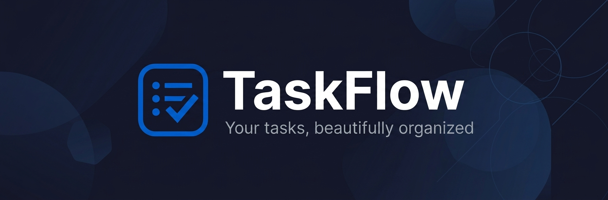
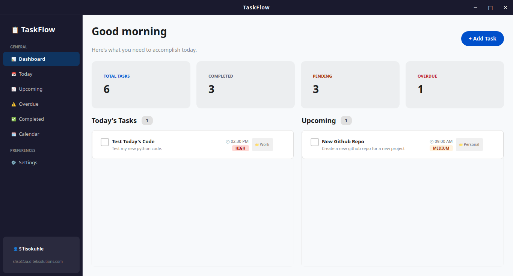
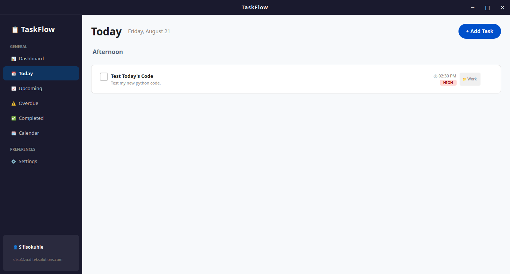
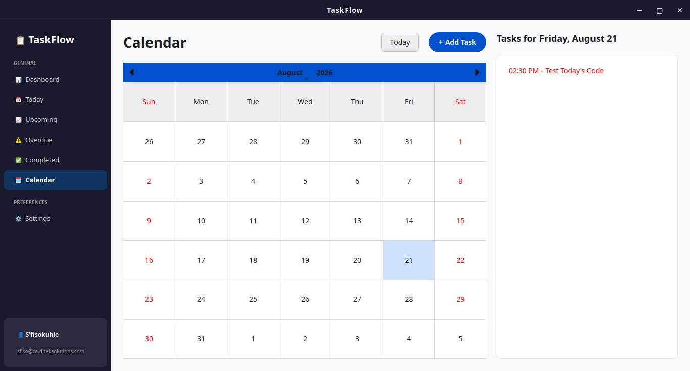

# TaskFlow - Personal Task Management Application

**Developer:** Denzell S'fisokuhle Yonah



<div align="center">

[](https://www.python.org/)
[](https://wiki.qt.io/Qt_for_Python)
[](https://www.sqlalchemy.org/)
[](LICENSE)
[](CONTRIBUTING.md)

</div>

## 📋 Overview

TaskFlow is a modern, cross-platform desktop application for personal task management and scheduling. Built with Python and Qt, it provides a clean, intuitive interface for organizing your daily tasks, setting reminders, and staying productive.

### Why TaskFlow?

* 🎯 **Focused on Simplicity**: Clean, distraction-free interface
* 🚀 **Fast & Responsive**: Built with performance in mind
* 💾 **Offline-First**: All data stored locally in SQLite
* 🔔 **Smart Notifications**: Never miss an important task
* 🎨 **Beautiful Dark Theme**: Easy on the eyes, modern design

## ✨ Features

### Task Management

* ✅ Create, edit, complete, and delete tasks
* 📊 Set priorities (Low, Medium, High)
* 🗂️ Organize with custom categories
* 🔄 Restore completed tasks
* 📝 Add descriptions and context

### Smart Scheduling

* 📅 Set due dates and times
* ⏰ Customizable reminders (5 min to 1 day before)
* 🔔 Desktop notifications for upcoming tasks
* 📊 Visual calendar view
* 🎯 Today, Upcoming, and Overdue views

### User Interface

* 🌙 Beautiful dark theme (light theme coming soon)
* 📱 Responsive layout
* 🖱️ Right-click context menus
* ⌨️ Keyboard shortcuts
* 🎨 Custom title bar with centered title

### Data Management

* 💾 SQLite database with SQLAlchemy ORM
* 🔒 Safe transactions and data integrity
* 📦 Local data storage (OS-specific directories)
* 🔄 Automatic database migrations

## 🖼️ Screenshots

<div align="center">

### Dashboard View



### Task Management



### Calendar View



</div>

## 🚀 Quick Start

### Prerequisites

* Python 3.12 or higher
* pip (Python package manager)

### Installation

```bash
# Clone the repository
git clone https://github.com/denny-ashwood/taskflow.git
cd taskflow

# Create virtual environment (optional but recommended)
python -m venv venv
source venv/bin/activate  # On Windows: venv\Scripts\activate

# Install dependencies
pip install -r requirements.txt

# Run the application
python main.py
```